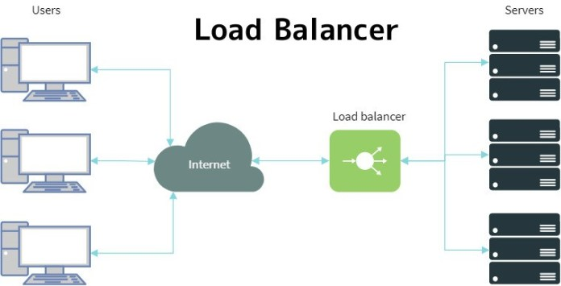
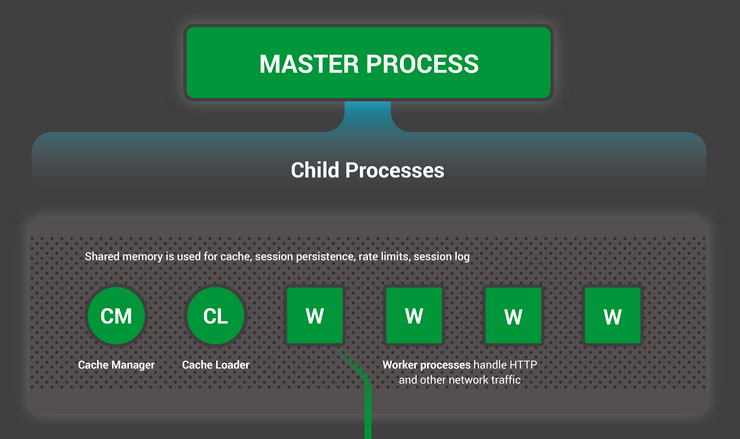
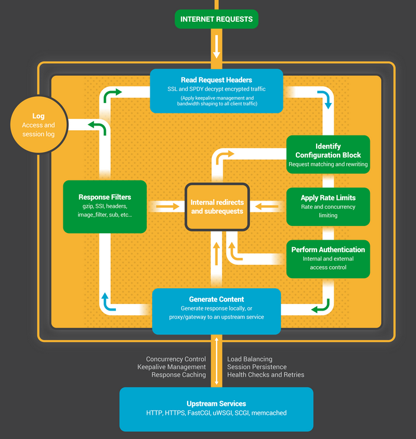

## 1. Load balancer

Load balancing là quá trình phân phối lưu lượng mạng trên nhiều server. Đảm bảo lưu lượng mạng được phâ phối đều cho các server. Load balancing tăng tính availability của ứng dụng và website cho người dùng. Load balancing đặc biệt quan trọng và gần như bắt buộc đối với các hệ thống lớn, khi mà lượng traffic qua lại dày đặc và cùng thời điểm. 

Divice thực hiện load balancing được gọi là Load balancer. Load balancer thường nằm ngay 'cửa' giao tiếp của một hệ thống, tiếp nhận luồng thông tin từ bên ngoài (người dùng) và quyết định xem server nào của hệ thống sẽ xử lý phần thông tin đó.
## 2. NGINX

NGINX là một web server, có thể dùng như một reverse proxy, load balancer. NGINX được tạo ra bởi Igor Sysoev - một kỹ sư người Nga, phiên bản chính thức đầu tiên được release vào năm 2014.  
 
NGINX là một **phần mềm** free và open-source.  

### Sơ lược về kiến trúc của NGINX

- Điểm manh của NGINX là tốc độ nhanh, sử dụng ít tài nguyên đặc biệt là cho những hệ thống lớn. (tính scalabbility).

Lý do đằng sau những đặc tính này của NGINX là một kiến trúc hướng sự kiện (event-driven), bất đồng bộ (asyschronous), single thread (một thread xử lý nhiều request cùng lúc) và non-blocking. 

#### NGINX run như thế nào ?

NGINX có một master process (được khởi tạo đầu tiên) làm các công việc 'nhẹ nhàng' như cấu hình cho chương trình, binding to ports và khởi tạo các process con gồm cache manager, cache loader và các worker thread.  

Cache manager và cache loader quản lý phần dữ liệu cache trên ổ đĩa. Còn toàn bộ các công việc chính khác được xử lý bỏi worker thread. 

Worker thread được tạo ra và cung cấp sẵn một list các listent sockets từ master thread. Worker thread sau đó bắt đầu đợi các event trên các listen socket này. Các event này được khởi tạo từ những incoming connections. Với kiến trúc event-driven, NGINX implement một state machine để handle các event này.  

### Ưu điểm của kiến trúc 'single thread'

### Nhược điểm của NGINX

