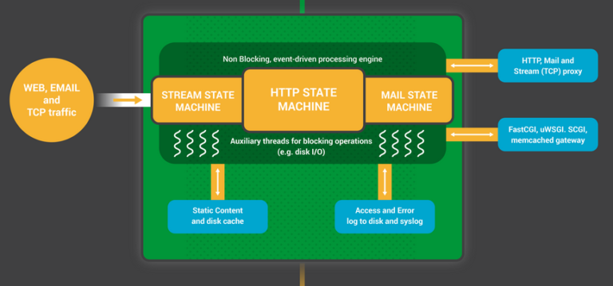
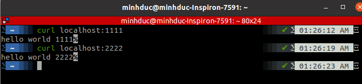
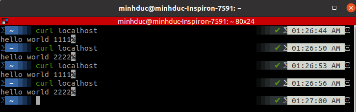

# LOAD BALANCER

## 1. Load balancer

Load balancing là quá trình phân phối lưu lượng mạng trên nhiều server. Đảm bảo lưu lượng mạng được phâ phối đều cho các server. Load balancing tăng tính availability của ứng dụng và website cho người dùng. Load balancing đặc biệt quan trọng và gần như bắt buộc đối với các hệ thống lớn, khi mà lượng traffic qua lại dày đặc và cùng thời điểm. 

Divice thực hiện load balancing được gọi là Load balancer. Load balancer thường nằm ngay 'cửa' giao tiếp của một hệ thống, tiếp nhận luồng thông tin từ bên ngoài (người dùng) và quyết định xem server nào của hệ thống sẽ xử lý phần thông tin đó.

Load balancer tối ưu hóa việc sử dụng tài nguyên, băng thông, giảm độ trễ, tăng khả năng chịu lỗi.

### Phân loại

Load balancer gồm 2 loại chính: layer 4 và layer 7.

- Layer 4 load balancer (hay L4 for short) hoạt động trên layer 4 của OSI model. Khi client request, tạo một kết nối TCP với L4, L4 sẽ dùng chính gói tin kết nối này (sửa lại IP và port) rồi kết nối với upstream server. Như vậy L4 chỉ đơn giản là chuyển tiếp gói dữ liệu mạng đến upstream server mà không kiểm tra nội dung gói dữ liệu.

- Layer 7 load balancer (L7) hoạt động ở tầng 7 trong mô hình OSI. L7 đánh giá dữ liệu trên giao thức http để điều phối gói tin. 

### Một số phương pháp load balancing

- Random: Phân phối request ngẫu nhiên cho các server.

- Round robin: Phân phối request lần lượt cho các server.

- Weighted round robin: Giống như round robin nhưng tính thêm lượng trọng tải của mối server. ví dụ server 1 có thể xử lý gấp đối tải trọng so với server 2 nên request sẽ tới server 1 hai lần rồi mới tới server 2.

- Least connections: Phân phối tới server có ít kết nối nhất hiện tại.

## 2. NGINX

NGINX là một web server, có thể dùng như một reverse proxy, load balancer. NGINX được tạo ra bởi Igor Sysoev - một kỹ sư người Nga, phiên bản chính thức đầu tiên được release vào năm 2014.  
 
NGINX là một **phần mềm** free và open-source.  

### Sơ lược về kiến trúc của NGINX

- Điểm manh của NGINX là tốc độ nhanh, sử dụng ít tài nguyên đặc biệt là cho những hệ thống lớn. (tính scalabbility).

Lý do đằng sau những đặc tính này của NGINX là một kiến trúc hướng sự kiện (event-driven), bất đồng bộ (asyschronous), single thread (một thread xử lý nhiều request cùng lúc) và non-blocking. 

#### NGINX run như thế nào ?

NGINX có một master process (được khởi tạo đầu tiên) làm các công việc 'nhẹ nhàng' như cấu hình cho chương trình, binding to ports và khởi tạo các process con gồm cache manager, cache loader và các worker thread.  

Cache manager và cache loader quản lý phần dữ liệu cache trên ổ đĩa. Còn toàn bộ các công việc chính khác được xử lý bỏi worker thread. 

#### Bên trong một worker thread 

Worker thread được tạo ra và cung cấp sẵn một list các listent sockets từ master thread. Worker thread sau đó bắt đầu đợi các event trên các listen socket này. Các event này được khởi tạo từ những incoming connections. Với kiến trúc event-driven, NGINX implement một state machine lướt qua tất cá các request liên tục để handle các event này.  

Phần lớn các webserver sử dụng kiến trúc thread-per-connection (cứ một request từ user, server sẽ tạo ra một thread mới để xử lý riêng cho request đó). Nhưng trong phần lớn thòi gian là thời gian thread đó bị 'blocked', nó đợi phản ứng tiếp theo của người dùng. Việc này gây tiêu tốn tài nguyên máy tính. Khi lượng truy cập tăng mạnh trong cùng một thời điểm, lượng thread đồng thời cũng tăng theo mà chi phí trên mỗi thread không hề nhỏ (về mặt bộ nhớ, thời gian và cpu), còn bị lãng phí (trong thời gian bị blocked).

#### Ưu điểm của kiến trúc 'single thread'

Các hoạt động cần xử lý như listen socket, trả lời kết nối, xử lý request,.. tạo thành một hàng đợi event (epoll or kqueue). Worker sẽ lướt qua hàng đợi này và xử liên tiếp các yêu cầu. Worker không bao giờ chờ đợi respond từ user. Thay vào đó worker ngay lập tức xử lý các request khác đang cần được giải quyết.

Nhờ đó mỗi worker có thể handle hàng trăm ngàn kết nối cùng một lúc. Mỗi kết nối tạo ra một file mô tả và chỉ chiếm một lượng nhỏ bộ nhớ.

Trong khi đó, với kiến trúc one-thread-per-connection, mỗi kết nối yêu cầu một lượng lớn tài nguyên chờ sẵn (nhưng ít khi dùng hết), và việc tạo lập, phá hủy, giao tiếp giữa các thread diễn ra rất thường xuyên.

#### Nhược điểm của NGINX

- Cộng đồng phát triển NGINX chưa đủ mạnh.
- Hỗ trợ rất tốt static content nhưng NGINX không thể xử lý dynamic content một cách 'native' mà cần thông qua các giao thức khác như fastCGI.
- Không có nhiều modules/extentions hỗ trợ.

# Coding

File [run.sh](../src/01-load-balancing/run.sh) sẽ tự động cấu hình NGINX thành một Load balancer listen tại port 80. Sau đó tự động tạo file [httpserver.py](../src/01-load-balancing/httpserver.py), tiếp tục thực thi file này thì được một web python server trên 2 port 1111 và 2222. Load balancer sau đó cân bằng tải trên 2 port này.

## 1. & 2. Làm một web tĩnh đơn giản bằng python rồi cho chạy trên 2 port khác nhau

File [httpserver.py](../src/01-load-balancing/httpserver.py) tạo một web server đơn giản có 2 thread, một thread chính listen ở port 2222, thread con listen ở port 1111.

Run file bằng lệnh 

    python3 httpserver.py

Kiểm tra lại bằng curl trên 2 port 1111 và 2222

## 3. Cài đặt NGINX

File /etc/nginx/sites-enabled/default có cấu hình như sau:

    upstream web_backend {
	server localhost:1111;
	server localhost:2222;
    }
    server {
        listen 80;
        location / {
            proxy_set_header X-Forwarded-For ;
            proxy_pass http://web_backend;

        }
    }

Sau khi thay đổi file default cần reload hoặc restart NGINX.

    sudo systemctl reload nginx

## Kết quả 

Sau khi run file [run.sh](../src/01-load-balancing/run.sh) ta dùng curl kiểm tra trên port 80 sẽ thấy server trả về kết quả luân phiên giữa 2 port (do mặc định NGINX sẽ chạy load balancing theo thuật toán round-robin):

