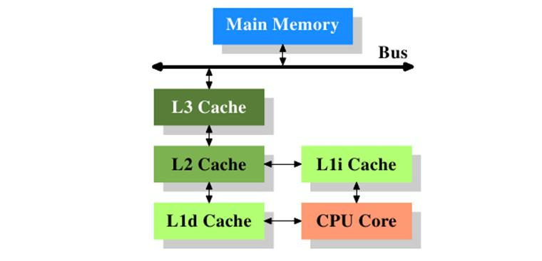
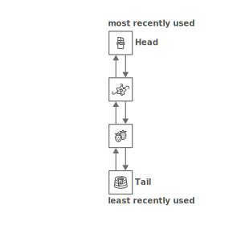
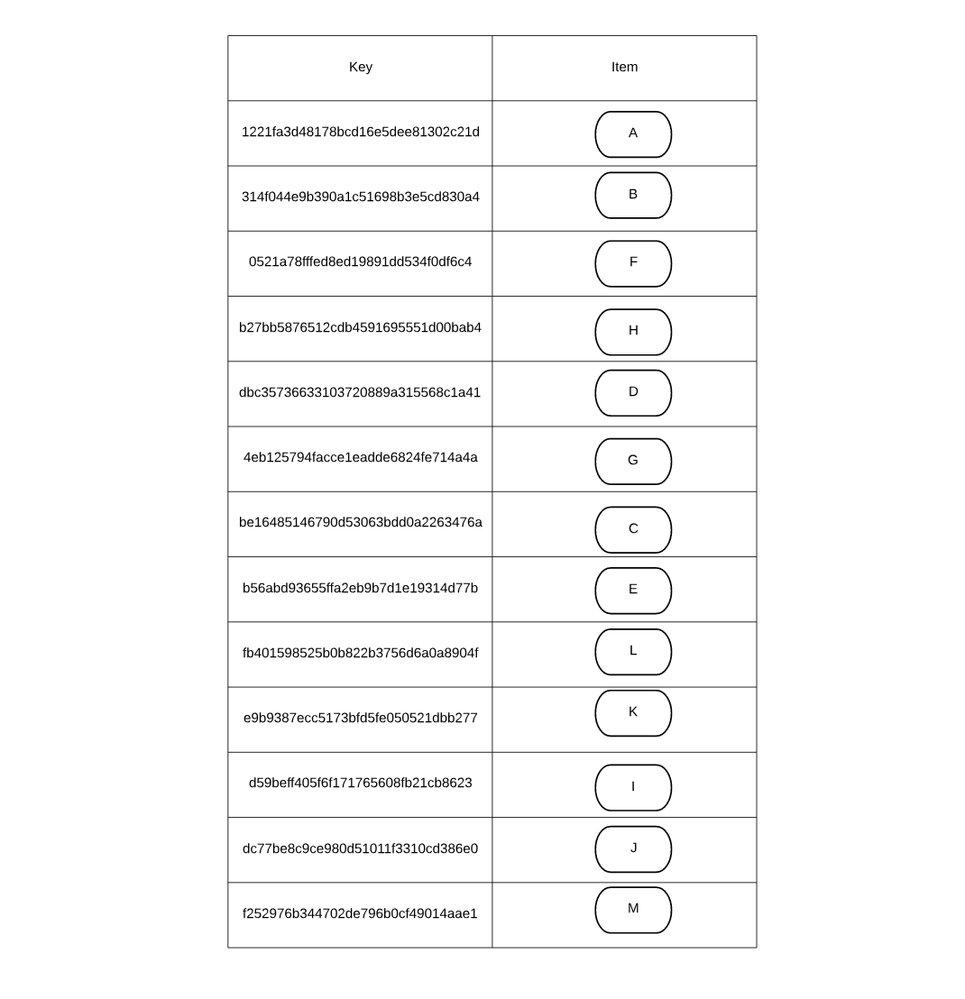
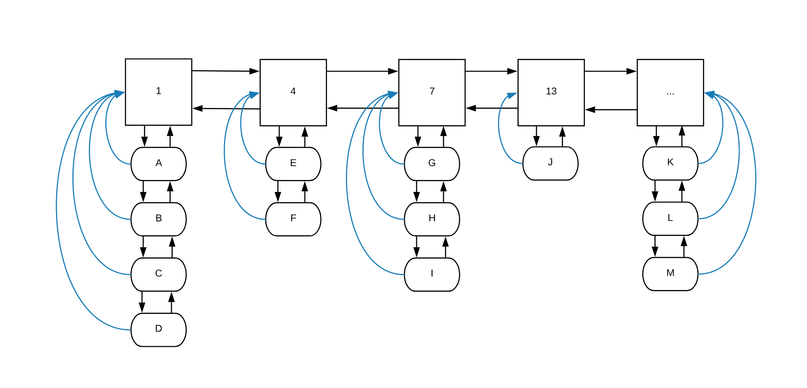

# CACHING

## 1. Vai trò của cache

Cache là một thành phần phần cứng hoặc phần mềm dùng lưu trữ dữ liệu để phục vụ cho các request tương lai, giúp các request đó lấy dữ liệu ra nhanh hơn.

Ví dụ như CPU cache, dữ liệu được lưu trong cache gần CPU sẽ được CPU lấy ra nhanh hơn là dữ liệu nằm trong RAM. Từ đó người ta có thể tăng tốc chương trình bằng cách lưu trữ dữ liệu hay dùng vào cache để giảm thời gian truy cập RAM của CPU.

Đặc điểm chung là cache sẽ nằm gần nguồn request, lưu trữ các thông tin mà cache nghĩ rằng sẽ được dùng nhiều trong tương lai gần.

Tùy thuộc vào vị trí, nhiệm vụ, cache có nhiều loại khác nhau: web cache, disk cache, CPU cache,...

Như vậy vai trò chính của cache là tăng tốc chương trình, tăng tốc độ truy cập, giảm thời gian trễ. 
## 2. Các thuật toán caching

Bộ nhớ cache thường có tốc truy xuất nhanh nhưng đổi lại lưu lượng thường thấp. Thậm chí một số cache có thời gian truy xuất với các phần tử trong nó là khác nhau. Nên cần phải một thuật toán caching, thể cách lưu trữ, thay thế dữ liệu để phát huy tối đa khả năng của một cache.

### Kỹ thuật Least recently used (LRU)

Là một kỹ thuật loại bỏ những data cũ nhất trong cache (những data đã quá lâu không được truy xuất) để tạo khoảng trống cho các data mới.

Có nhiều cách để implement một LRU cache. Dưới đây sử dụng một cách quen thuộc.

Dùng một double linked list để lưu các phần tử . Khi một phần tử được truy xuất sẽ được mang lên đầu đầu list, dồn các phần còn lại xuống dưới. Khi đó ta có phần tử tail của list là phần tử ít dùng nhất, để loại bỏ phần tử này chỉ tốn thời gian O(1). Khi thêm một tử mới, phần tử sẽ được thêm vào đầu list, nên thời gian thêm vào cũng chỉ tốn O(1). Nhưng thời gian truy xuất tới một phần tử bất kỳ có thể mất tới O(n).

Dùng thêm một hash map để lưu địa chỉ mỗi các phần tử trong linked list. Khi đó thời gian truy xuất tới mọi phần tử chỉ mất O(1). Xóa một tử khỏi hash map cũng chỉ mất thời gian O(1) (áp dụng với hash map xử lý đụng độ bằng linked list). 

Tổng kết ta có performance cho implement trên như sau:

| Cost | |
|-----------------------------------|-----------|
| | Worst case |
| space | O(n) |
| delete least recently used item | O(1) |
| add new item | O(1) |
| access item | O(1) |

Động lực đằng sau LRU rất rõ ràng và rất tự nhiên: xóa đi những phần tử cũ nhất. Nên LRU được dùng rất rộng rãi trong loại cache khác nhau: web cache, disk cache,...

### Kỹ thuật Least frequently used (LFU)

Một kỹ thuật tương tự như LRU, LFU loại bỏ phần tử có số lần truy xuất thấp nhất. 

Để maintain số lần truy cập, implement của LFU cũng phức tạp hơn LRU rất nhiều.

Dưới đây trình bày một implement khá dễ hiểu với chi phí cho mọi hoạt động đều bằng O(1).

Thuật toán dùng 2 double linked list và một hash table. 

Hash table dùng để lưu các phần tử (item). Ở đây key là một mã hash nhận dạng của item đó. Để cho ta có thể lưu key là bất cứ thứ gì sao cho khi muốn access tới một item thì ta chỉ cần mã key đó. Hash table đảm bảo thời gian truy xuất một phần tử là O(1)

Để maintain số lần truy xuất tới một phần tử , ta cần một double linked list lưu số lần truy xuất theo thứ tự tăng dần, gọi là 'frequency list', mỗi phần tử trong list này trỏ tới một double linked list chứa các item có số lần truy xuất bằng giá trị của phần tử trong frequency list. Linked list chứa các item gọi là item list.

Điều đặc biệt là mỗi phần tử trong item list ngoài 2 con trỏ (next và pre) thì còn thêm một con trỏ nữa trỏ tới phần tử cha của nó trong frequency list.

Khi một phần tử được truy xuất, số lần truy xuất sẽ phải tăng thêm một. Ta có thuật toán tăng số lần truy xuất của phần E như sau:

- Dùng hash table truy cập tới phần tử  E
- Dùng con trỏ truy cập tới item trong frequency list, từ đó biết được phần tử frequency tiếp theo (frequency hiện tại bằng 4, tiếp theo bằng 5).
- Nếu phần tử frequency tiếp là liên tiếp với phần tử frquency hiện tại (tồn tại một frequency item bằng 5), ta push item E làm phần tử đầu tiên trong item list của phần tử frequency 5.
- Nếu không liên tiếp, tạo phần tử frequency 5, thêm vào frequency list, rồi thêm E vào item list của nó.

Mọi bước đều có chi phí thời gian O(1) từ đó ta có chi phí cho việc thay đổi số lần truy cập một phần tử là O(1).

Việc thêm một phần tử đơn giản hơn, phần tử có sô lần truy cập bằng 1, nên ta chỉ việc kiểm tra phần tử đầu tiên trong frequency list có bằng 1 không, nếu có thì thêm item với vào đầu list item của nó, nếu không thì tạo phần tử frequency list 1, rồi thêm item mới vào item list của nó.

Việc thêm một phần tử cũng chỉ tốn thời gian O(1).

Xóa đi phần tử Least frequently used, chỉ việc xóa đi phần tử cuối cùng trong item list của phần tử đầu tiên trong frequency list, trong ví dụ ở trên, đó là phần tử D. 

Xóa đi phần tử Least frequently used tốn thời gian O(1).

Xét về măt bộ nhớ, ta mất O(n) cho các item list, số lượng phần tử trong frequency list cũng nhỏ hơn hoặc bằng số item nên cũng chỉ tốn bộ nhớ O(n). Hash map tốn thêm O(n) ô nhớ. Vậy chi phí lưu trữ là O(n)

Tổng kết ta có performance cho implement trên như sau:

| Cost | |
|-----------------------------------|-----------|
| | Worst case |
| space | O(n) |
| delete least frequently used item | O(1) |
| add new item | O(1)|
| access item | O(1) |

