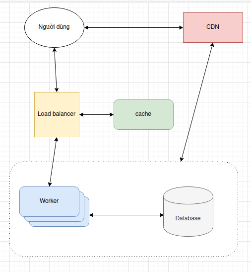
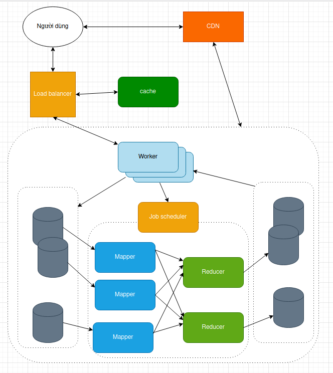

# Blog system

Thiết kế một sản phẩm blogging cho 10 triệu người dùng Việt Nam.

Giả sử traffic ước lượng như sau: Mỗi giây có 2000 người post blog mới, đồng thời mỗi giây cũng có 200000 queries tới đọc blog.

## User features

- Đảm bảo người dùng đọc blog có tốc độ load càng nhanh càng tốt.

- Người dùng thấy được danh sách các bài post của một blogger.

- Người dùng có thể đăng ký tài khoản để trở thành blogger. Tài khoản blogger dùng để comment và post bài viết.

- Blogger có thể post bài viết mới, bài viết mới sẽ được nhìn thấy trong khoảng thời gian không quá lâu sau khi post (10 giây).

- Blogger có thể sửa lại bài viết cũ, thời gian để người đọc thấy sự thay đổi cũng không được quá lâu (10 giây).

- Blogger có thể comment trên một post bằng tài khoản blog của mình.

-Một blogger có thể follow nhiều blogger khác.

## Những gợi ý đầu tiên

- Vì blog có lượng content chủ yếu là static nên có thể dùng CDN đặt gần người dùng, cho trải nghiệm tốt hơn.

- Ta có thể lưu tất cả thông tin liên quan đến một blogger thành hồ sơ cá nhân của blogger đó, gồm: thông tin cá nhân, nội dung tất cả các bài post, những blogger đã theo dõi. (Phần nội dung bài post đã bao gồm các comment ở trong post đó).  
Ta thấy rằng mọi feature chỉ là thay đổi trên hồ sơ cá nhân này.

- Ta cần lưu thêm một vài mối quan hệ:
    - Một blogger theo dõi một blogger khác. Blogger có thể thấy được danh sách những người mình đã theo dõi.
    - Trong một bài post có danh sách các comment từ blogger khác. 

- Lượng request lớn, ta cần mộ hệ thống server lớn nên chắc chắn phải có một hệ thống load balancer.

- Vì các bài post hầu như không thay đổi nên ta có thể tận dụng caching để tăng tốc độ truy xuất.

Từ đó ta được một hệ thống sau:

Ở đây có thể có một 'nút thắt cổ chai', đó chính là disk I/O, do lượng dữ liệu lớn, nên việc tìm kiếm một hồ sơ cá nhân, một bài post sẽ rất khó khăn, mô hình MapReduce rất thích hợp trong trường hợp này.

MapReduce sử dụng một hệ thống tập tin phân tán giúp các disk I/O có thể hoàn thành song song nhau.

